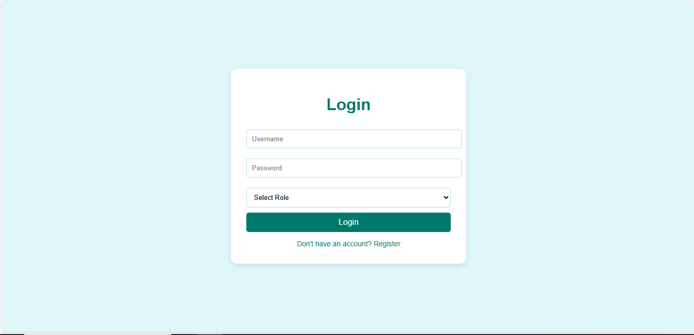
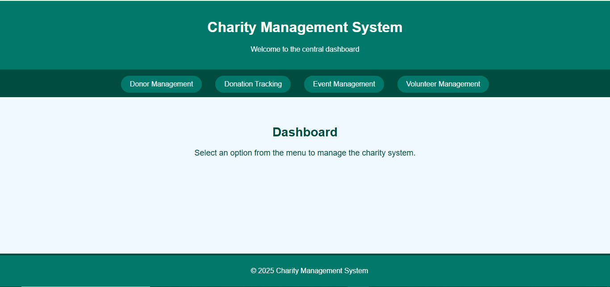

# **Charity Management System**

## **Project Description**

The **Charity Management System** is a web-based application designed to help manage charity operations efficiently. It allows users to manage donations, donors, volunteers, and activities while ensuring all data is systematically stored and easily accessible. The system aims to simplify charity workflows and improve transparency in operations.

## **Features**

- **User Registration and Login**:

Users can register and log in to access the system.

- **Donation Management**:

Add and track donations made by donors.

Store details such as amount, purpose, and date of donations.

- **Donor Management**:

Maintain profiles of donors.

View and manage donor information and donation history.

- **Volunteer Management**:

Record volunteer information such as name, email, phone, and availability.

- **Activity Management**:

Schedule and manage charity activities or events.

## **Technologies Used**

- **Frontend**:

**HTML/CSS**: For designing the user interface.

**JavaScript**: For dynamic functionality.

- **Backend**:

**PHP**: For handling server-side operations and database connectivity.

- **Database**:

**MySQL**: To store and manage data.

- **Development Tools**:

**XAMPP**: For local hosting and database management.

## **Installation and Usage**

### **Requirements:**

- XAMPP or WAMP server installed on your system.
- Web browser (e.g., Chrome, Firefox).

### **Setup Instructions:**

- **Download XAMPP** (if not already installed)
- **Move the Project Files**:

Place your project folder (e.g., db project) inside the htdocs directory of your XAMPP installation

- **Start XAMPP**:
- Open the XAMPP Control Panel.
- Start the **Apache** and **MySQL** services.
- **Import the Database**:
- Open your browser and navigate to <http://localhost/phpmyadmin>.
- Create a new database named charity_system.
- Import the charity_system.sql file into the database.
- **Access the Application**:
- Open your browser and navigate to <http://localhost/db> project to run the application.

## **How to Use**

1. **Login**:
    1. Use the login form to access the system.
2. **Add Donors**:
    1. Navigate to the Donor Management page to add or view donors.
3. **Track Donations**:
    1. Record new donations or view donation history.
4. **Manage Volunteers**:
    1. Add volunteers and track their availability.
5. **Plan Activities**:
    1. Create and manage charity activities or events.

## **Screenshots**

1. **Login Page:**

1. **Dashboard:**

1. **Donation Management:**

1. **Donation Tracking**

1. **Event Management**

1. **Volunteer Management**

## **Future Enhancements**

1. Add email notifications for new donations and volunteer tasks.
2. Integrate a payment gateway for online donations.
3. Optimize the system for mobile devices with a responsive design.

## **Contributors**

- Nimra Abid BSE233075
- Nawal Fatima BSE233211
- Javeria Waheed BSE233180

## **License**

This project is open-source and available under the MIT License.